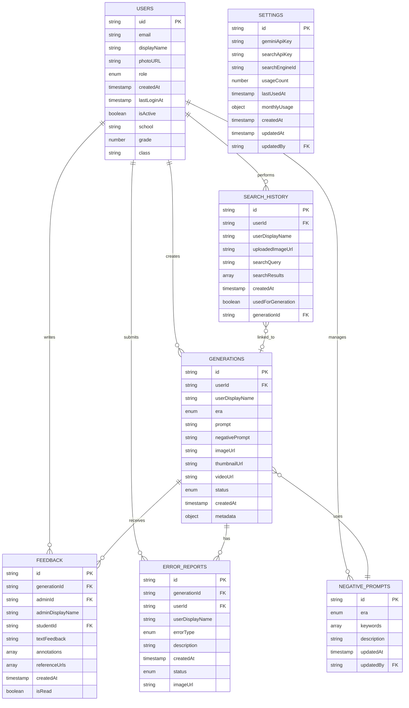

# 한국사 디지털 교육자료 앱 - 데이터 스키마

이 문서는 앱에서 사용하는 Firestore 데이터베이스의 컬렉션 구조와 TypeScript 타입 정의를 설명합니다.

## 목차

1. [Firestore 컬렉션 구조](#1-firestore-컬렉션-구조)
2. [컬렉션별 필드 정의](#2-컬렉션별-필드-정의)
3. [TypeScript 타입 정의](#3-typescript-타입-정의)
4. [ER 다이어그램](#4-er-다이어그램)
5. [인덱스 설정](#5-인덱스-설정)

---

## 1. Firestore 컬렉션 구조

```
firestore/
├── users/                    # 사용자 정보
│   └── {userId}/
├── generations/              # 생성된 이미지/영상
│   └── {generationId}/
├── feedback/                 # 교사 피드백
│   └── {feedbackId}/
├── error-reports/            # 고증 오류 보고
│   └── {reportId}/
├── search-history/           # 검색 기록
│   └── {historyId}/
├── negative-prompts/         # 네거티브 프롬프트
│   └── {promptId}/
└── settings/                 # 앱 설정
    └── app-config
```

---

## 2. 컬렉션별 필드 정의

### 2.1 users (사용자)

사용자 계정 및 프로필 정보를 저장합니다.

| 필드명 | 타입 | 필수 | 설명 |
|--------|------|------|------|
| `uid` | `string` | O | Firebase Auth UID (문서 ID와 동일) |
| `email` | `string` | O | 이메일 주소 |
| `displayName` | `string` | O | 표시 이름 |
| `photoURL` | `string` | X | 프로필 이미지 URL |
| `role` | `UserRole` | O | 역할 (`student` \| `admin`) |
| `createdAt` | `Timestamp` | O | 계정 생성 시간 |
| `lastLoginAt` | `Timestamp` | O | 마지막 로그인 시간 |
| `isActive` | `boolean` | O | 계정 활성화 상태 |
| `school` | `string` | X | 소속 학교 (학생 필수) |
| `grade` | `number` | X | 학년 (1-3, 학생 필수) |
| `class` | `string` | X | 학급 (예: "1반", 학생 필수) |

**예시 문서:**
```json
{
  "uid": "abc123def456",
  "email": "student@school.edu",
  "displayName": "홍길동",
  "role": "student",
  "createdAt": "2024-01-15T09:00:00Z",
  "lastLoginAt": "2024-01-20T14:30:00Z",
  "isActive": true,
  "school": "서울중학교",
  "grade": 2,
  "class": "3반"
}
```

---

### 2.2 generations (생성물)

AI로 생성된 이미지 및 관련 정보를 저장합니다.

| 필드명 | 타입 | 필수 | 설명 |
|--------|------|------|------|
| `id` | `string` | O | 문서 ID |
| `userId` | `string` | O | 생성자 UID |
| `userDisplayName` | `string` | X | 생성자 이름 (비정규화) |
| `era` | `Era` | O | 시대 구분 |
| `prompt` | `string` | O | 사용자 입력 프롬프트 |
| `negativePrompt` | `string` | O | 적용된 네거티브 프롬프트 |
| `imageUrl` | `string` | O | 생성된 이미지 URL |
| `thumbnailUrl` | `string` | X | 썸네일 이미지 URL |
| `videoUrl` | `string` | X | 생성된 영상 URL |
| `status` | `GenerationStatus` | O | 승인 상태 |
| `createdAt` | `Timestamp` | O | 생성 시간 |
| `metadata` | `object` | O | 생성 메타데이터 |
| `metadata.generationTime` | `number` | O | 생성 소요 시간 (ms) |
| `metadata.model` | `string` | O | 사용된 AI 모델 |

**Era 값:**
- `goryeo`: 고려시대
- `joseon-early`: 조선 초기
- `joseon-mid`: 조선 중기
- `joseon-late`: 조선 후기
- `japanese-occupation`: 일제강점기

**GenerationStatus 값:**
- `pending`: 검토 대기
- `approved`: 승인됨
- `rejected`: 반려됨
- `revision-requested`: 수정 요청

**예시 문서:**
```json
{
  "id": "gen123",
  "userId": "user456",
  "userDisplayName": "홍길동",
  "era": "joseon-mid",
  "prompt": "임진왜란 당시 이순신 장군의 거북선",
  "negativePrompt": "chinese style, japanese style, anime...",
  "imageUrl": "https://storage.googleapis.com/...",
  "status": "pending",
  "createdAt": "2024-01-20T10:00:00Z",
  "metadata": {
    "generationTime": 15000,
    "model": "gemini-2.0-flash-exp"
  }
}
```

---

### 2.3 feedback (피드백)

교사가 학생 생성물에 대해 제공하는 피드백입니다.

| 필드명 | 타입 | 필수 | 설명 |
|--------|------|------|------|
| `id` | `string` | O | 문서 ID |
| `generationId` | `string` | O | 대상 생성물 ID |
| `adminId` | `string` | O | 피드백 작성 교사 UID |
| `adminDisplayName` | `string` | X | 교사 이름 (비정규화) |
| `studentId` | `string` | O | 학생 UID |
| `textFeedback` | `string` | O | 텍스트 피드백 내용 |
| `annotations` | `Annotation[]` | O | 이미지 주석 배열 |
| `referenceUrls` | `string[]` | O | 참고 자료 URL 목록 |
| `createdAt` | `Timestamp` | O | 피드백 작성 시간 |
| `isRead` | `boolean` | O | 학생 읽음 여부 |

**Annotation 구조:**

| 필드명 | 타입 | 설명 |
|--------|------|------|
| `id` | `string` | 주석 ID |
| `type` | `AnnotationType` | 주석 유형 (`circle` \| `arrow` \| `text` \| `rectangle`) |
| `x` | `number` | X 좌표 |
| `y` | `number` | Y 좌표 |
| `width` | `number` | 너비 (선택) |
| `height` | `number` | 높이 (선택) |
| `endX` | `number` | 끝점 X (화살표용) |
| `endY` | `number` | 끝점 Y (화살표용) |
| `text` | `string` | 텍스트 내용 (선택) |
| `color` | `string` | 색상 코드 |

---

### 2.4 error-reports (오류 보고)

사용자가 발견한 고증 오류를 보고합니다.

| 필드명 | 타입 | 필수 | 설명 |
|--------|------|------|------|
| `id` | `string` | O | 문서 ID |
| `generationId` | `string` | O | 대상 생성물 ID |
| `userId` | `string` | O | 보고자 UID |
| `userDisplayName` | `string` | X | 보고자 이름 (비정규화) |
| `errorType` | `ErrorType` | O | 오류 유형 |
| `description` | `string` | O | 오류 상세 설명 |
| `createdAt` | `Timestamp` | O | 보고 시간 |
| `status` | `ReportStatus` | O | 처리 상태 |
| `imageUrl` | `string` | X | 오류 증거 이미지 URL |

**ErrorType 값:**
- `costume`: 복식 오류
- `architecture`: 건축 오류
- `artifact`: 유물 오류
- `anachronism`: 시대착오
- `other`: 기타

**ReportStatus 값:**
- `pending`: 검토 대기
- `reviewed`: 검토 완료
- `resolved`: 해결됨

---

### 2.5 search-history (검색 기록)

사용자의 자료 검색 기록을 저장합니다.

| 필드명 | 타입 | 필수 | 설명 |
|--------|------|------|------|
| `id` | `string` | O | 문서 ID |
| `userId` | `string` | O | 검색자 UID |
| `userDisplayName` | `string` | X | 사용자 이름 (비정규화) |
| `uploadedImageUrl` | `string` | X | 업로드한 이미지 URL |
| `searchQuery` | `string` | O | 검색어 |
| `searchResults` | `SearchResult[]` | O | 검색 결과 배열 |
| `createdAt` | `Timestamp` | O | 검색 시간 |
| `usedForGeneration` | `boolean` | X | 생성에 사용 여부 |
| `generationId` | `string` | X | 연결된 생성물 ID |

**SearchResult 구조:**

| 필드명 | 타입 | 설명 |
|--------|------|------|
| `title` | `string` | 검색 결과 제목 |
| `link` | `string` | 결과 URL |
| `snippet` | `string` | 내용 요약 |
| `thumbnailUrl` | `string` | 썸네일 URL (선택) |
| `source` | `string` | 출처 |

---

### 2.6 negative-prompts (네거티브 프롬프트)

시대별 금지 키워드 및 프롬프트를 관리합니다.

| 필드명 | 타입 | 필수 | 설명 |
|--------|------|------|------|
| `id` | `string` | O | 문서 ID |
| `era` | `Era \| 'global'` | O | 적용 시대 (`global`은 전역) |
| `keywords` | `string[]` | O | 금지 키워드 배열 |
| `description` | `string` | O | 설명 |
| `updatedAt` | `Timestamp` | O | 마지막 수정 시간 |
| `updatedBy` | `string` | O | 수정자 UID |

**문서 ID 규칙:**
- `prompt-global`: 전역 네거티브 프롬프트
- `prompt-goryeo`: 고려시대
- `prompt-joseon-early`: 조선 초기
- `prompt-joseon-mid`: 조선 중기
- `prompt-joseon-late`: 조선 후기
- `prompt-japanese-occupation`: 일제강점기

---

### 2.7 settings (설정)

앱 전역 설정 및 API 키를 저장합니다.

#### settings/app-config

| 필드명 | 타입 | 필수 | 설명 |
|--------|------|------|------|
| `id` | `string` | O | 문서 ID (`app-config`) |
| `geminiApiKey` | `string` | O | Gemini API 키 |
| `searchApiKey` | `string` | X | Google Search API 키 |
| `searchEngineId` | `string` | X | Google 검색 엔진 ID |
| `usageCount` | `number` | O | 총 API 사용 횟수 |
| `lastUsedAt` | `Timestamp` | O | 마지막 사용 시간 |
| `monthlyUsage` | `object` | X | 월별 사용량 통계 |
| `createdAt` | `Timestamp` | O | 생성 시간 |
| `updatedAt` | `Timestamp` | O | 수정 시간 |
| `updatedBy` | `string` | O | 수정자 UID |

**monthlyUsage 구조:**
```json
{
  "2024-01": {
    "imageGeneration": 150,
    "textGeneration": 300,
    "searchQueries": 50,
    "totalCost": 12.50
  }
}
```

---

## 3. TypeScript 타입 정의

```typescript
import { Timestamp } from 'firebase/firestore';

// 시대 타입
export type Era = 'goryeo' | 'joseon-early' | 'joseon-mid' | 'joseon-late' | 'japanese-occupation';

// 사용자 역할
export type UserRole = 'student' | 'admin';

// 사용자 인터페이스
export interface User {
  uid: string;
  email: string;
  displayName: string;
  photoURL?: string;
  role: UserRole;
  createdAt: Timestamp;
  lastLoginAt: Timestamp;
  isActive: boolean;
  school?: string;
  grade?: number;
  class?: string;
}

// 생성물 상태
export type GenerationStatus = 'pending' | 'approved' | 'rejected' | 'revision-requested';

// 생성물 인터페이스
export interface Generation {
  id: string;
  userId: string;
  userDisplayName?: string;
  era: Era;
  prompt: string;
  negativePrompt: string;
  imageUrl: string;
  thumbnailUrl?: string;
  videoUrl?: string;
  status: GenerationStatus;
  createdAt: Timestamp;
  metadata: {
    generationTime: number;
    model: string;
  };
}

// 주석 타입
export type AnnotationType = 'circle' | 'arrow' | 'text' | 'rectangle';

// 주석 인터페이스
export interface Annotation {
  id: string;
  type: AnnotationType;
  x: number;
  y: number;
  width?: number;
  height?: number;
  endX?: number;
  endY?: number;
  text?: string;
  color: string;
}

// 피드백 인터페이스
export interface Feedback {
  id: string;
  generationId: string;
  adminId: string;
  adminDisplayName?: string;
  studentId: string;
  textFeedback: string;
  annotations: Annotation[];
  referenceUrls: string[];
  createdAt: Timestamp;
  isRead: boolean;
}

// 오류 보고 타입
export type ErrorType = 'costume' | 'architecture' | 'artifact' | 'anachronism' | 'other';

// 오류 보고 상태
export type ReportStatus = 'pending' | 'reviewed' | 'resolved';

// 오류 보고 인터페이스
export interface ErrorReport {
  id: string;
  generationId: string;
  userId: string;
  userDisplayName?: string;
  errorType: ErrorType;
  description: string;
  createdAt: Timestamp;
  status: ReportStatus;
  imageUrl?: string;
}

// 네거티브 프롬프트 인터페이스
export interface NegativePrompt {
  id: string;
  era: Era | 'global';
  keywords: string[];
  description: string;
  updatedAt: Timestamp;
  updatedBy: string;
}

// 검색 결과
export interface SearchResult {
  title: string;
  link: string;
  snippet: string;
  thumbnailUrl?: string;
  source: string;
}

// 검색 이력
export interface SearchHistory {
  id: string;
  userId: string;
  userDisplayName?: string;
  uploadedImageUrl?: string;
  searchQuery: string;
  searchResults: SearchResult[];
  createdAt: Timestamp;
  usedForGeneration?: boolean;
  generationId?: string;
}

// API 키 설정 인터페이스
export interface ApiKeyConfig {
  id: string;
  geminiApiKey: string;
  searchApiKey?: string;
  searchEngineId?: string;
  usageCount: number;
  lastUsedAt: Timestamp;
  monthlyUsage?: {
    [yearMonth: string]: {
      imageGeneration: number;
      textGeneration: number;
      searchQueries: number;
      totalCost: number;
    };
  };
  createdAt: Timestamp;
  updatedAt: Timestamp;
  updatedBy: string;
}

// 시대 정보 인터페이스
export interface EraInfo {
  id: Era;
  name: string;
  nameEn: string;
  period: string;
  description: string;
  keywords: string[];
  imagePromptPrefix: string;
}
```

---

## 4. ER 다이어그램



---

## 5. 인덱스 설정

Firestore 복합 인덱스가 필요한 쿼리:

### 5.1 generations 컬렉션

```
# 사용자별 생성물 목록 (최신순)
Collection: generations
Fields: userId (Ascending), createdAt (Descending)

# 상태별 생성물 목록 (최신순)
Collection: generations
Fields: status (Ascending), createdAt (Descending)
```

### 5.2 feedback 컬렉션

```
# 학생별 피드백 목록 (최신순)
Collection: feedback
Fields: studentId (Ascending), createdAt (Descending)

# 생성물별 피드백 목록 (최신순)
Collection: feedback
Fields: generationId (Ascending), createdAt (Descending)

# 학생별 읽지 않은 피드백
Collection: feedback
Fields: studentId (Ascending), isRead (Ascending)
```

### 5.3 error-reports 컬렉션

```
# 상태별 오류 보고 목록 (최신순)
Collection: error-reports
Fields: status (Ascending), createdAt (Descending)
```

### 5.4 search-history 컬렉션

```
# 사용자별 검색 기록 (최신순)
Collection: search-history
Fields: userId (Ascending), createdAt (Descending)

# 사용자별 미사용 검색 기록
Collection: search-history
Fields: userId (Ascending), usedForGeneration (Ascending), createdAt (Descending)
```

---

## 참고 자료

- 타입 정의 파일: `src/types/index.ts`
- Firestore 유틸리티: `src/lib/firebase/firestore.ts`
- Firebase 설정: `src/lib/firebase/config.ts`
